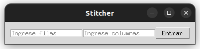
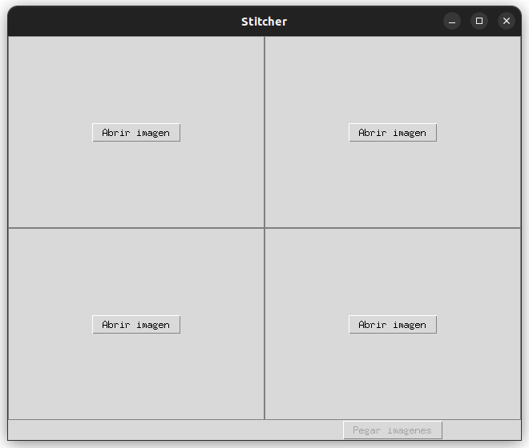
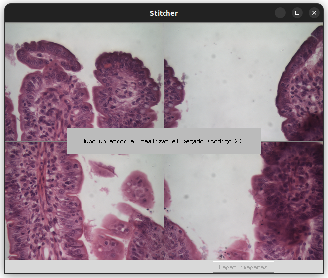

# Generador de panoramas para microscopio virtual

## Instalacion

### Requerimientos:
    - Python 3.10 o mayor
    - numpy
    - opencv-python
    - opencv-contrib-python (para tener acceso a *SURF* y *SIFT*)
    - tkinter
    - pyinstaller (opcional para generar ejecutable)

Para ejecutar el código se debe instalar Python 3.10 y algún distribuidor de paquetes (ya sea *pip* o *conda*).
Luego instalar las distintas bibliotecas, en caso de utilizar *pip* se debería ejecutar el comando:

    $ pip install numpy opencv-python opencv-contrib-python tk pyinstaller

Las nuevas versiones de *OpenCV* (3>=) no tienen los algoritmos de detección de características no-libres para el uso comercial en su versión estándar. Para poder acceder a ellas se debe compilar la biblioteca desde fuente utilizando el flag **OPENCV_ENABLE_NONFREE**. O alternativamente utilizar una versión más vieja de la misma, lo cual no fue testeado y probablemente genere errores sintácticos en el código.

Si se desea compilar desde código fuente (recomendado) se puede seguir el siguiente tutorial: https://pyimagesearch.com/2018/08/15/how-to-install-opencv-4-on-ubuntu/.

## Modos de uso:

### Opciones:
Una vez instaladas las dependencias se puede correr la aplicación ejecutando:
    
    $ python stitcher_app.py

Con las siguientes opciones:
* **-h**, **--help** : lista opciones de ejecución
* **-wd**, **--width** : cambia ancho de ventana (640px por default)
* **-hg**, **--height** : cambia alto de ventana (480px por default)
* [ **--SIFT** | **--ORB** ] : utiliza el descriptor SIFT u ORB respectivamente como descriptor de características (por default se utiliza SURF)

### Interfaz gráfica:
Al ejecutarse el programa se abrira una ventana de dialogo (Imagen 1) donde se debe especificar la cantidad de filas y columnas del muestreo tomado.

Una vez que se ingresaron las cantidades apropiadas, se verá en la ventana una grilla del tamaño provisto donde se deben cargar las imagenes (Imagen 2). 

Y luego de cargar las imagenes:

Notar que si una imagen fue mal cargada, al pasar el mouse por arriba la interfaz nos permite cambiarla.
Luego de que se llene la grilla, el botón de texto *Pegar imagenes* en la esquina inferior derecha de la ventana se habrá habilitado.
Al clickearlo comenzará el proceso de pegado. El algoritmo es muy demandante, por lo tanto dependendiendo de las características del hardware y el tamaño de las imagenes podría llegar a tardar varios minutos, o incluso horas. Es muy importante prestar atención especialmente a esta última variable.
El algoritmo no realiza ninguna tarea de compresión o *resizing* de las imagenes, con lo cual si estamos utilizando imagenes de tamaño 1920x1080px en una grilla de 6 filas y 7 columnas la imagen final podría llegar a medir en un peor caso (sin tener en cuenta la superposición entre estas) del orden 6480x13440px. Esto conlleva una capacidad de computo y memoria disponible bastante grande. Por lo tanto para un uso beneficioso de la herramienta, convendría cambiar el tamaño de las imagenes de entrada de antemano para alcanzar las dimensiones finales deseadas.

Al finalizar el pegado, se encontrará en la carpeta donde se ejecutó el programa la imagen final con nombre '*panorama.png*' (Imagen 4).

### Consideraciones:

Los algoritmos tradicionales para extracción de *features* fueron diseñados en su mayoría para fotografía tradicional, por lo tanto las imagenes obtenidas por un microscopio pueden llegar a ser muy problemáticas, proveyendonos una baja densidad y calidad de las mismas. Por lo tanto es muy importante que las imagenes de entrada tengan alrededor de un 30% de solapamiento entre si, de esta forma podemos mitigar un poco este problema.

En cuanto a los descriptores en si, en las pocas pruebas que realicé, **SURF** fue el que mejor resultados dió, con mayor cantidad de *features*. **SIFT** tambien dió buenos resultados pero un poco peores que **SURF** (hay casos particulares donde tal vez falla) y por último **ORB** no me anduvo bien casi nunca, lo cual es una lástima porque es el único de los tres que es de libre uso.

### Códigos de error:

Si el algoritmo de pegado llegase a fallar puede deberse a muchos motivos. Si nos encontrasemos con que el código de error fue el **02** (Imagen 5, se genera el error al utilizar el descriptor **ORB**) significa que no hubo suficientes coincidencias entre los *features* de las imagenes. Puede probarse cambiando el descriptor.
Si esto tampoco da resultados, actualmente no se provee una solución. Hay parametros dentro del algoritmo que podrían modificarse para ver si se encuentra una mejoría pero esto no es provisto dentro de la interfaz.

